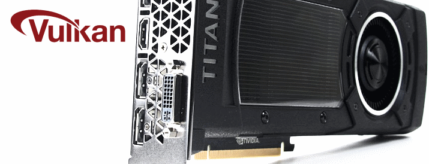

# vulkan [](https://travis-ci.org/nimious/vulkan)

Nim bindings for Vulkan, the API for access to graphics and compute on GPUs.




## About

This package contains bindings to Vulkan for the [Nim](http://nim-lang.org)
programming language. Vulkan is a unified specification that minimizes driver
overhead and enables multi-threaded GPU command preparation for optimal graphics
and compute performance on diverse mobile, desktop, console and embedded
platforms.


## Supported Platforms

This package was last built and tested with **Vulkan 1.0.61.1**. The bindings
currently support the following platforms:

- ~~Android~~
- ~~Linux~~
- Windows


## Prerequisites

Download and install the latest *Vulkan SDK* from the Khronos download page.


## Dependencies

This package does not have any dependencies to other Nim packages at this time.


## Usage

Import the *vulkan* module from this package to make the bindings available in
your project:

```nimrod
import vulkan
```


## Support

Please [file an issue](https://github.com/nimious/vulkan/issues), submit a
[pull request](https://github.com/nimious/vulkan/pulls?q=is%3Aopen+is%3Apr)
or email us at info@headcrash.industries if this package is out of date or contains bugs.


## References

* [Khronos Vulkan Homepage](https://www.khronos.org/vulkan/)
* [Khronos Vulkan Registry](https://www.khronos.org/registry/vulkan/)
* [Nim Programming Language](http://nim-lang.org/)
* [MSYS2 on GitHub](http://msys2.github.io/)
